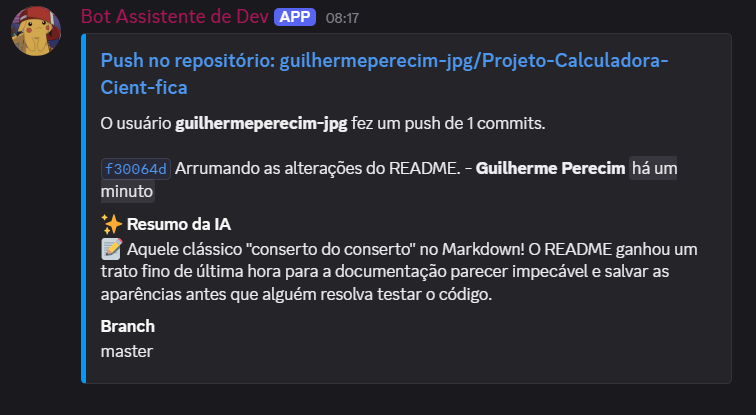

# 🛰️ RepoRadar


**RepoRadar** é um bot inteligente para Discord desenvolvido em Node.js com TypeScript que integra a API do Discord diretamente aos Webhooks do GitHub. Ele monitora repositórios em tempo real e notifica seu servidor sobre novos commits e pull requests, fornecendo detalhes como autor, timestamp relativo, commits resumidos e links diretos.

Além disso, utiliza o **Google Gemini (3.5 Flash)** para analisar o contexto das alterações e gerar resumos inteligentes, objetivos e bem-humorados de cada push — com proteção de escopo e sistema de contingência (*fallback*) automático.

---

## 📸 Demonstração em Ação

<p align="center">
  
</p>

---

## ✨ Principais Funcionalidades

- 🔔 **Notificações em Tempo Real** — Alertas instantâneos no Discord para eventos de `push` e `pull_request`.
- 🤖 **Resumos com IA de Alta Performance** — Análise semântica dos commits via **Google Gemini 3.5 Flash**.
- 🛡️ **Proteção de Escopo e Segurança** — O modelo trata os commits como dados estritos de código, prevenindo desvios de finalidade e injeções de prompt em mensagens de commit.
- 🔄 **Sistema de Contingência (Fallback Automático)** — Caso o endpoint da IA sofra instabilidades temporárias (como erro 503), o bot alterna automaticamente para modelos de backup (`gemini-3.5-flash-lite`, `gemini-flash-latest`).
- 🎛️ **Painel Interativo de Inicialização** — Ao ligar, o bot envia uma mensagem com botões interativos (`ActionRowBuilder` / `ButtonBuilder`) para confirmar o repositório padrão ou configurar um novo.
- 📌 **Persistência de Dados** — Salva as preferências de monitoramento em um arquivo `config.json` local para não perder o repositório configurado após reinicializações.
- ⚡ **Slash Commands Modernos** — Comandos de barra integrados (`/ping`, `/criador`, `/status`).
- 🔍 **Filtro Inteligente de Repositórios** — Processa apenas webhooks pertencentes ao repositório selecionado, descartando eventos não monitorados.

---

## 🏗️ Arquitetura do Sistema

```
GitHub (Push / PR)
       │
       ▼  (HTTP POST / Webhook)
Smee.io (Túnel Dev) / URL Pública (Prod)
       │
       ▼
Servidor Express (/webhooks/github)
       │
  ┌────┴────────────────────────┐
  ▼                             ▼
Filtro de Repositório     Google Gemini (IA)
(Ignora não-monitorados)  (Resumo dos Commits)
  │                             │
  └────┬────────────────────────┘
       ▼
Discord.js (Client)
       │
       ▼
Canal do Discord (Embeds Ricos)
```

---

## 🚀 Como Executar o Projeto

### 📋 Pré-requisitos

1. **[Node.js](https://nodejs.org/)** v18 ou superior.
2. **[Discord Developer Portal](https://discord.com/developers/applications)**:
   - Criar uma aplicação e um Bot.
   - **IMPORTANTE:** Na aba **Bot** > seção **Privileged Gateway Intents**, ative a opção **Message Content Intent** (necessária para os coletores interativos de configuração no chat).
3. **[Google AI Studio](https://aistudio.google.com/app/apikey)**:
   - Obter uma chave de API gratuita para o Gemini (`GEMINI_API_KEY`).

---

### 📦 Passo a Passo de Instalação

**1. Clone o repositório:**
```bash
git clone https://github.com/guilhermeperecim-jpg/repo-radar.git
cd repo-radar
```

**2. Instale as dependências:**
```bash
npm install
```

**3. Configure as variáveis de ambiente:**

Copie o arquivo de exemplo:
```bash
cp .env.example .env
```

Preencha os valores no `.env`:
```env
# Variáveis obrigatórias do Discord
DISCORD_TOKEN=seu_token_do_bot_aqui
DISCORD_CHANNEL_ID=id_do_canal_onde_as_mensagens_sao_enviadas

# Variáveis da IA (Google Gemini)
GEMINI_API_KEY=sua_chave_da_api_do_gemini
GEMINI_MODEL=gemini-3.5-flash

# Segurança do Webhook do GitHub (Recomendado para produção)
GITHUB_WEBHOOK_SECRET=seu_segredo_do_webhook_github

# Porta do servidor Express
PORT=3000
```

> **Como obter cada informação:**
> - `DISCORD_TOKEN`: Portal do Desenvolvedor Discord > Sua Aplicação > Aba **Bot** > Botão **Reset Token**.
> - `DISCORD_CHANNEL_ID`: No Discord (com o Modo Desenvolvedor ativo), clique com o botão direito no canal desejado > **Copiar ID do canal**.
> - `GEMINI_API_KEY`: Acesse o [Google AI Studio](https://aistudio.google.com/app/apikey) e clique em **Create API Key**.
> - `GITHUB_WEBHOOK_SECRET`: Qualquer senha/chave forte definida por você e informada no campo **Secret** do Webhook no GitHub.

---

### 🏃‍♂️ Executando a Aplicação

**Modo Desenvolvimento (com recarregamento automático):**
```bash
npm run dev
```

**Compilar e Rodar em Produção:**
```bash
npm run build
npm start
```

Saída esperada no terminal:
```text
🤖 Bot conectado como RepoRadar#1234
✅ Comandos de barra (/) registrados com sucesso!
🌐 Servidor Webhook rodando na porta 3000
```

---

## 🔗 Configurando os Webhooks do GitHub

### 🛠️ Em Desenvolvimento (Ambiente Local)

1. Instale o cliente do Smee globalmente:
   ```bash
   npm install --global smee-client
   ```
2. Acesse [smee.io](https://smee.io/) e clique em **Start a new channel**.
3. Copie a URL gerada (ex: `https://smee.io/xyz123`).
4. No repositório do GitHub que deseja monitorar:
   - Vá em **Settings** > **Webhooks** > **Add webhook**.
   - **Payload URL:** Cole a sua URL do Smee.
   - **Content type:** Escolha `application/json`.
   - **Which events would you like to trigger this webhook?:** Selecione `Just the push event` ou `Let me select individual events` (marque *Pushes* e *Pull requests*).
5. Em um terminal separado, inicie o encaminhador:
   ```bash
   npx smee-client -u https://smee.io/SUA_URL -t http://localhost:3000/webhooks/github
   ```

### 🌐 Em Produção (Hospedagem em Nuvem)

1. Faça o deploy da aplicação em serviços como Render, Railway, Fly.io ou VPS.
2. No GitHub Webhooks, a **Payload URL** será:  
   `https://sua-aplicacao.com/webhooks/github` com `Content type: application/json`.

---

## 💬 Comandos de Barra (Slash Commands)

| Comando | Descrição |
| :--- | :--- |
| `/ping` | Mede a latência da API do Discord e tempo de resposta. |
| `/criador` | Exibe os créditos e informações do desenvolvedor. |
| `/status` | Mostra qual repositório do GitHub está atualmente sob monitoramento ativo. |

---

## 🗂️ Estrutura do Projeto

```
repo-radar/
├── assets/
│   └── demo.png              # Imagem de demonstração para o README
├── src/
│   ├── index.ts              # Ponto de entrada da aplicação (inicia Bot e Servidor)
│   ├── bot/
│   │   ├── client.ts         # Instância do Discord.js, comandos e manipuladores
│   │   └── configManager.ts  # Gerenciador de leitura/escrita do config.json
│   └── server/
│       ├── webhook.ts        # Servidor Express, rotas HTTP e formatação de embeds
│       └── ai.ts             # Integração com Google Gemini (com fallback resiliente)
├── config.json               # Armazena o repositório atualmente monitorado
├── .env.example              # Modelo das variáveis de ambiente
├── .gitignore                # Arquivos ignorados pelo Git
├── package.json              # Dependências e scripts do projeto
├── tsconfig.json             # Configurações do compilador TypeScript
└── README.md                 # Documentação completa do projeto
```

---

## 🛠️ Tecnologias Utilizadas

- **[Node.js](https://nodejs.org/)** — Runtime JavaScript assíncrono.
- **[TypeScript](https://www.typescriptlang.org/)** — Superset tipado para maior confiabilidade de código.
- **[Discord.js](https://discord.js.org/)** (v14) — Biblioteca oficial para desenvolvimento de bots Discord.
- **[Express](https://expressjs.com/)** — Framework HTTP rápido para processar payloads de Webhooks.
- **[Google Generative AI](https://ai.google.dev/)** — SDK oficial do Google Gemini para IA generativa.
- **[Dotenv](https://github.com/motdotla/dotenv)** — Carregamento de variáveis de ambiente seguras.
- **[Smee.io](https://smee.io/)** — Túnel de entrega de Webhooks para testes em localhost.

---

## 📄 Licença

Este projeto está licenciado sob a licença **MIT** — consulte o arquivo [LICENSE](LICENSE) para mais detalhes.

---

Embora existam ferramentas que fazem parte do que o RepoRadar faz (como webhooks nativos ou CLIs de resumo), o RepoRadar é uma solução completa que une monitoramento em tempo real, inteligência artificial e interatividade em um único bot — algo que não encontrei em nenhum outro projeto open source.

## 👨‍💻 Autor

Desenvolvido por **Guilherme Perecim**.

[](https://github.com/guilhermeperecim-jpg)
